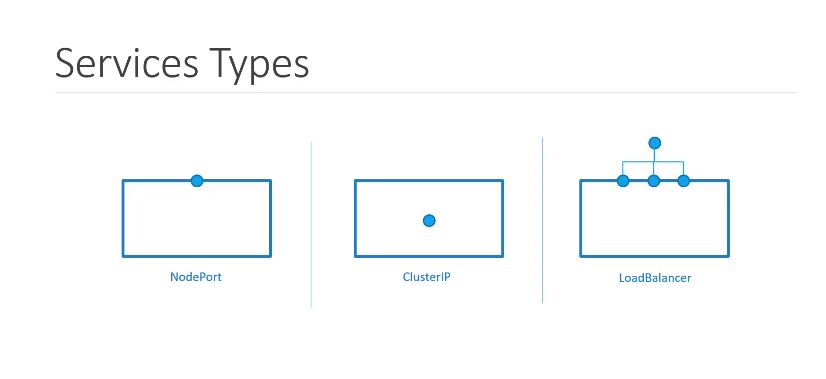
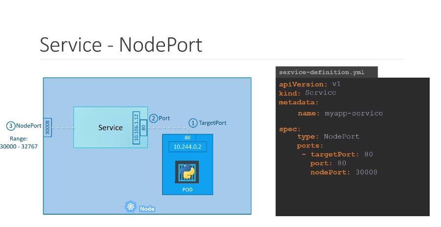

#### Pod :
A Kubernetes pod is a group of containers that are deployed together on 
the same host. 

Yaml Pod definition file :
has a 4 propriete level apiVersion,kind,metadata and spec .

```yaml
apiVersion: v1
kind: Pod
metadata:
 name : myapp-pod
 labesl:
   app: myapp
   # we can have many labels as we want like
   #costcenter: value
   #locatopn: name
   #type: frontend
spec:
  # is unique to eatch object created is have containers 
  containers: # containers is a list of different containers  
    - name: nginx-container # name of my container
      image: nginx # the name of the image itself
    # we can add another container to my pod
    #- name: backend-container
    #  image: redis
```
to create pod via terminal on kubernetes : 
```kubectl create -f pod-definition.yml --validate=false ```
to see pods states :``` kubectl get pods```
to delete deploiement : ```kubectl delete deployement nginx # if a previos deployement exist ```

##### Creating a Deployment
creates a ReplicaSet to bring up three nginx Pods:

```yml
apiVersion: apps/v1
kind: Deployment
metadata:
  name: nginx-deployment #A Deployment named nginx-deployment is created
  labels:
    app: nginx
spec:
  replicas: 3
  selector:
    matchLabels:
      app: nginx #field defines how the Deployment finds which Pods to manage
  template:
    metadata:
      labels:
        app: nginx
    spec:
      containers:
      - name: nginx
        image: nginx:1.14.2
        ports:
        - containerPort: 80
```
1. Create the Deployment by running the following command: ``` kubectl apply -f controller/nginx-deployment.yaml  ``` 

2. check if the Deployment ``` kubectl get deployments  ```


##### Updating a Deployment :

1. update the nginx Pods to use the nginx:1.16.1 image instead of the nginx:1.14.2 image : ``` kubectl --record deployment.apps/nginx-deployment set image deployment.v1.apps/nginx-deployment nginx=nginx:1.16.1 ```
or ``` kubectl set image deployment/nginx-deployment nginx=nginx:1.16.1 --record ```


2. run ``` kubectl get deployments ``` to check pods deployement 

3. at edit a deployement a new replicat set will be created run this command to check the new one : ``` kubectl get rs ```

4. ```kubectl get pods ``` 


##### Rolling Back a Deployment :

when the Deployment is not stable, such as crash looping. By default, all of the Deployment’s rollout history is kept in the system so that you can rollback anytime you want

scenario :

1. update image : ```kubectl set image deployment.v1.apps/nginx-deployment nginx=nginx:1.161 --record=true```

2. check the revisions of this Deployment: ```kubectl rollout history deployment.v1.apps/nginx-deployment```

3. To see the details of each revision : ```kubectl rollout history deployment.v1.apps/nginx-deployment --revision=2```

4. Rolling Back to a Previous Revision : ``` kubectl rollout undo deployment.v1.apps/nginx-deployment --to-revision=2```

5. to check if roll back is sucessfully done :

```sh
kubectl get deployment nginx-deployment
kubectl describe deployment nginx-deployment
```


#### Services :

to enable connectivity between groups or pods , and enhance connectivity for data source or bachend .
is an object like a pod replicat set to listen to the port and forward request to the pod ,
many types of services :
Image=Images/pods





1. create diployement :

```yml
apiVersion: v1
Kind: ReplicationController
metadata:
 name : myapp-rc
 labesl:
   app: myapp
   type: front-end
spec:
  template: # pod template we can re use the previos definition of nginx 
pod  
      metadata:
       name : myapp-pod
       labesl:
         app: myapp
      spec:
        containers: 
          - name: nginx-container 
            image: nginx
  replicas: 3 # to create a 3 instance of pod 
```

2. define service :

service-definition.yml :
```yaml
apiVersion: v1
kind: Service
metadata:
  name: my-nginx #serviceName

spec:
  type: NodePort
  ports:
  - port: 80
    targetPort: 80
    nodePort: 30008

  selector: # the metadata of your pod application
    app: myapp
    type: front-end

 ```

 3. check the services :

 to create a service :
 ``` kubectl create -f
     kubectl get services
  ```

4. test on the defined port number :
 by curl command : curl http:<IPCluster>:30008 
and now we can access to the nginx directly on 30008 port number

Note : Kubernetes has automatically create a servces accross multiples Nodes on the cluster 

some tools command :

```sh
kubectl get services # or kubectl get svc
kubectl describe svc kubernetes # to get information about the services
kubectl expose deployment hello-world --type=NodePort --target-port=8080 --node-port=30080 --name=example-service --dry-run -o yaml > service-definition.yml #Create a Service object with example-service as name  that exposes the deployment named hello-world
#and then create the service by :
kubectl apply -f service-definition.yml

kubectl describe services example-service

# to get kubectl endpoint 
kubectl get ep webapp-service

#Cleaning :
kubectl delete service hello-node
kubectl delete deployment hello-node
 

```


```sh

#expose Services with Type=ClusterIP
kubectl expose deployment source-ip-app --name=clusterip --port=80 --target-port=8080

#expose Services with Type=NodePort
kubectl expose deployment source-ip-app --name=nodeport --port=80 --target-port=8080 --type=NodePort

#expose Services with Type=LoadBalancer
kubectl expose deployment source-ip-app --name=loadbalancer --port=80 --target-port=8080 --type=LoadBalancer

```

#### Container security : security context 

in runnig container we put some security input such as id of user to run this container or ...
docker run --cap-add MAC_ADMIN ubuntu 
that can be configured in the container level or pod level 

```yaml
apiVersion: v1
kind: Pod
metadata:
  name: security-context-demo-4
spec:
  containers:
  - name: sec-ctx-4
    image: gcr.io/google-samples/node-hello:1.0
    securityContext:
      #runAsUser: 1000
      #fsGroup: 1000
      capabilities:
        add: ["NET_ADMIN", "SYS_TIME"]
```